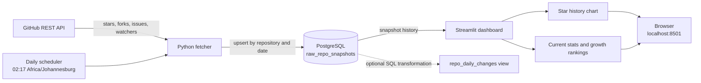

# GitHub Stats Pipeline

This project collects daily GitHub statistics for a set of public repositories,
stores them in PostgreSQL, and displays their star history and rankings in a
Streamlit dashboard. It is designed to run locally with Docker Compose.

## Project flow



### Components

- [`fetch_stats.py`](fetch_stats.py) calls the GitHub REST API for each tracked
  repository. It retries temporary network and server errors and reports API
  rate limits.
- [`run.py`](run.py) creates `raw_repo_snapshots` and saves the fetched values.
  The `(repo, snapshot_date)` primary key makes each daily write an upsert.
  It can also seed commit history into `raw_repo_commits`.
- [`scheduled_fetch.py`](scheduled_fetch.py) runs the pipeline immediately
  when its container starts, then schedules it every day at 02:17 South Africa
  time (`Africa/Johannesburg`).
- [`dashboard.py`](dashboard.py) reads snapshots from PostgreSQL and shows a
  selectable star-history line chart and a repository ranking table. Rankings
  can use current stars, forks, open issues, watchers, or average star change
  per elapsed day over 7 days, 30 days, or all available history.
- [`sql/repo_daily_changes.sql`](sql/repo_daily_changes.sql) optionally creates
  a view with daily star and fork changes and a seven-row rolling average of
  star changes. The dashboard does not require this view.
- [`docker-compose.yml`](docker-compose.yml) starts PostgreSQL, the fetch
  scheduler, and the dashboard. PostgreSQL data persists in the `db_data`
  volume.

### Tracked repositories

- `pandas-dev/pandas`
- `microsoft/vscode`
- `vercel/next.js`
- `facebook/react`
- `langchain-ai/langchain`
- `Holang-1/Car-Dealership`
- `apache/airflow`
- `dbt-labs/dbt-core`

## Start to finish: Docker Compose

### 1. Requirements

Install Docker Desktop or Docker Engine with the Docker Compose plugin. Run all
commands below from the project directory.

### 2. (Optional) Configure a GitHub token

Unauthenticated public API requests work, but GitHub applies a lower rate
limit. To use a personal access token, create a project `.env` file containing:

```dotenv
GITHUB_TOKEN=your_github_token
```

Keep `.env` private; it is excluded from the Docker build context. The token is
only used by the fetcher.

### 3. Build and start the services

```bash
docker compose up -d --build
```

The first build downloads Python and the project dependencies, so it can take
a few minutes. Check that the database is healthy and all three services are
running:

```bash
docker compose ps
```

Expected services are `db`, `fetcher`, and `dashboard`. The fetcher waits for
PostgreSQL to become healthy, runs a collection, then waits for the next
scheduled time. Follow the first fetch:

```bash
docker compose logs -f fetcher
```

Look for `SUCCESS repo=...` lines and a final `Run complete` summary. Press
Ctrl+C to stop following the logs; the services keep running.

### 4. Open the dashboard

Go to [http://localhost:8501](http://localhost:8501). The line chart plots
available daily star snapshots. The ranking table can sort by current stats
or star growth rate. With only one snapshot per repository, current stats are
available, but a growth rate needs at least two snapshots on different dates.
The dashboard caches database results for five minutes.

### 5. Confirm snapshots were saved

Run this query against the Compose database:

```bash
docker compose exec db psql -U postgres -d testdb -c \
  "SELECT repo, snapshot_date, stars, forks, open_issues, watchers FROM raw_repo_snapshots ORDER BY repo;"
```

You should see one row per successfully fetched repository for the current
snapshot date. If no rows appear, inspect the fetcher logs and check that the
GitHub API is reachable. To collect again immediately without waiting for the
next scheduled time:

```bash
docker compose exec fetcher python run.py
```

Repeated collections on the same date update the existing row.

### 6. Stop or reset the stack

```bash
docker compose down       # stop containers; keep collected snapshots
docker compose down -v    # stop containers and delete the database volume
```

The second command permanently deletes local snapshot and commit data.

### Compose shortcuts

If GNU Make is installed, the project Makefile provides shortcuts for common
commands:

| Command | Action |
| --- | --- |
| `make up` | Build and start all services |
| `make ps` | Show service status |
| `make logs` | Follow all service logs |
| `make logs-fetcher` | Follow fetcher logs |
| `make fetch` | Trigger a collection immediately |
| `make down` | Stop services and keep database data |
| `make down-volumes` | Stop services and delete database data |
| `make test` | Run the automated tests |

## Run automated tests

The unit tests use mocked GitHub responses and mocked database connections.
They do not require Docker, a live GitHub token, or a real database. In a
Python 3.12+ virtual environment, install project and test dependencies and
run:

```bash
python -m venv .venv
source .venv/bin/activate
python -m pip install -r requirements.txt pytest
python -m pytest
```

The tests cover API response parsing, pagination, retry and rate-limit
handling, snapshot upserts, commit-history upserts, and continuing after a
repository fails.

## Run without the Compose application services

To run Python and Streamlit on the host while keeping only PostgreSQL in
Docker, start the database:

```bash
docker compose up -d db
```

Create and activate a virtual environment, install dependencies, and collect a
snapshot:

```bash
python -m venv .venv
source .venv/bin/activate
python -m pip install -r requirements.txt
python run.py
```

Then start the dashboard in another terminal with the same virtual environment
activated:

```bash
streamlit run dashboard.py
```

The default database connection is the local Compose database (`localhost:5432`,
database `testdb`, user and password `postgres`). To use another database, set
`DATABASE_URL`, or configure `POSTGRES_HOST`, `POSTGRES_PORT`, `POSTGRES_USER`,
`POSTGRES_PASSWORD`, and `POSTGRES_DB`.

## Optional SQL view and commit history

After at least one stats collection, create the reporting view with:

```bash
docker compose exec -T db psql -U postgres -d testdb < sql/repo_daily_changes.sql
```

Query it with:

```bash
docker compose exec db psql -U postgres -d testdb -c \
  "SELECT repo, snapshot_date, stars_day_over_day_change, stars_growth_7_day_rolling_average FROM repo_daily_changes ORDER BY repo, snapshot_date;"
```

To backfill available GitHub commit SHAs and author/committer timestamps into
`raw_repo_commits`, run this from the host with the virtual environment active
and a database connection available:

```bash
python run.py --seed-commit-history
```

This backfill is independent of the daily snapshot dashboard.

## Troubleshooting

- **The page at localhost:8501 does not load:** run `docker compose ps` and
  confirm `dashboard` is running. If it is missing or stopped, run
  `docker compose up -d --build`, then inspect `docker compose logs dashboard`.
- **A port is already in use:** stop the process using port 8501 or 5432, then
  retry. The dashboard and database ports are declared in `docker-compose.yml`.
- **The dashboard reports a database error:** confirm `db` is healthy with
  `docker compose ps`, then check `docker compose logs dashboard db`.
- **The dashboard says there are no snapshots:** inspect fetcher logs and run
  `docker compose exec fetcher python run.py` to request a collection now.
- **GitHub rate limit reached:** configure `GITHUB_TOKEN` in `.env` and restart
  the fetcher with `docker compose up -d --force-recreate fetcher`.
- **See all service logs:** run `docker compose logs -f`.

## GitHub Actions alternative

The [daily-fetch workflow](.github/workflows/daily-fetch.yml) can collect
snapshots in GitHub Actions instead of running the Compose scheduler. It runs
at 02:17 UTC and supports manual runs from the Actions tab. Configure the
repository secrets `DATABASE_URL` (a persistent PostgreSQL connection string)
and `PIPELINE_GITHUB_TOKEN` (GitHub API token). GitHub-hosted runners are
temporary, so the workflow needs an external database. Avoid running both
schedulers against the same database unless both are intended to call the API;
same-day upserts are safe.
